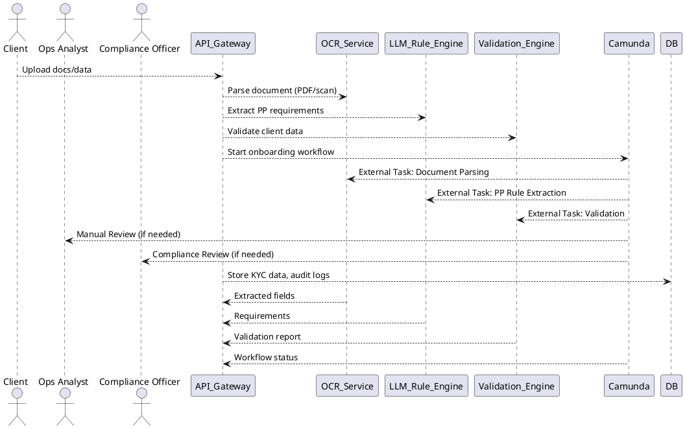

# System Architecture

## High-Level Diagram

## Component Descriptions

- **API Gateway**: Main entry point for all client and system requests. Orchestrates calls to OCR, LLM/Rule Engine, Validation Engine, and Camunda.
- **OCR Service**: Extracts structured data from uploaded documents using Tesseract or other OCR providers.
- **LLM/Rule Engine**: Extracts onboarding requirements from PP documents using LLMs or DMN rules.
- **Validation Engine**: Compares client data to requirements and returns a structured validation report.
- **Camunda Workflow Engine**: Orchestrates the onboarding process, including automated and manual review steps.
- **Database**: Stores client data, validation results, and audit logs.
- **Ops Analyst/Compliance Officer**: Human-in-the-loop for manual and compliance review tasks.

## Data Flow
1. Client submits onboarding package via API Gateway.
2. API Gateway stores data and triggers OCR, LLM/Rule Engine, and Validation Engine.
3. Camunda manages the workflow, invoking services as external tasks and routing exceptions to Ops/Compliance.
4. All actions and decisions are logged for audit and compliance.